# Neon Defence:
Neon Defence is an exciting tower defence game where your objective is to protect the Sun of Neon City from various types of enemies. Build and strategically place different types of turrets to fend off waves of incoming enemies and prevent them from reaching the Sun. If enemies manage to reach the Sun, you will lose a life. Be careful, as losing three lives will result in a game over.

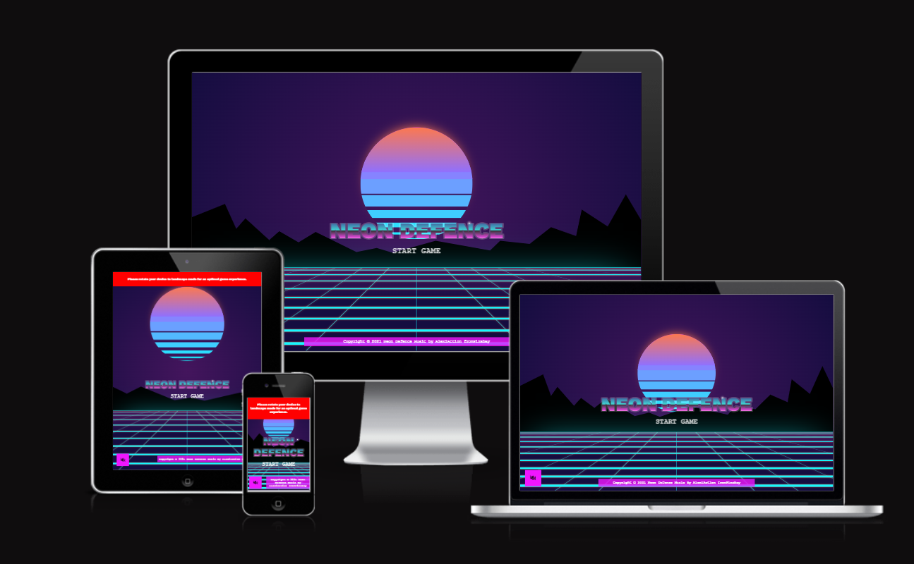

___

 

# Content

1. [Neon Defence](#neon-defence)
2. [Game Map](#game-map)
3. [Turrets](#turrets)
4. [Power Turrets](#power-turrets)
5. [Enemies](#enemies)
6. [How to Play](#how-to-play)
7. [Controls](#controls)
8. [Design](#design)
9. [Screenshots](#screenshots)
10. [Future Implementations](#future-implementations)
11. [Installation](#installation)
12. [Tech](#tech)
13. [Credits](#credits)
14. [License](#license)
15. [Feedback and Support](#feedback-and-support)

 

___

 

## Game Map
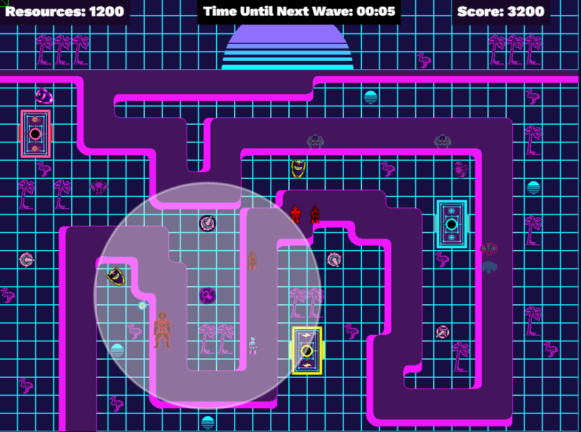

 

## Turrets:
Neon Defence features four unique types of turrets that you can utilize to defend against the enemy waves, and turrets level up after killing enough enemies:

### Auto Turret: 
This turret automatically fires at enemies within its range. It provides a consistent stream of damage to keep the enemy at bay.

### Laser Turret: 
The LaserTurret emits a high-intensity laser beam that can cut through enemies, dealing continuous damage to a single target. It's effective against tougher foes.

### Shotgun Turret: 
The ShotGunTurret unleashes a powerful shotgun blast that damages multiple enemies in a cone-shaped area. It's great for dealing with groups of weaker enemies.

### Human-Controlled Turret: 
The Human-Controlled Turret allows you, the player, to take control and manually aim and shoot at enemies. Use your skills to accurately eliminate threats and protect the Sun.

 

## Power Turrets:
### Fire Turret: 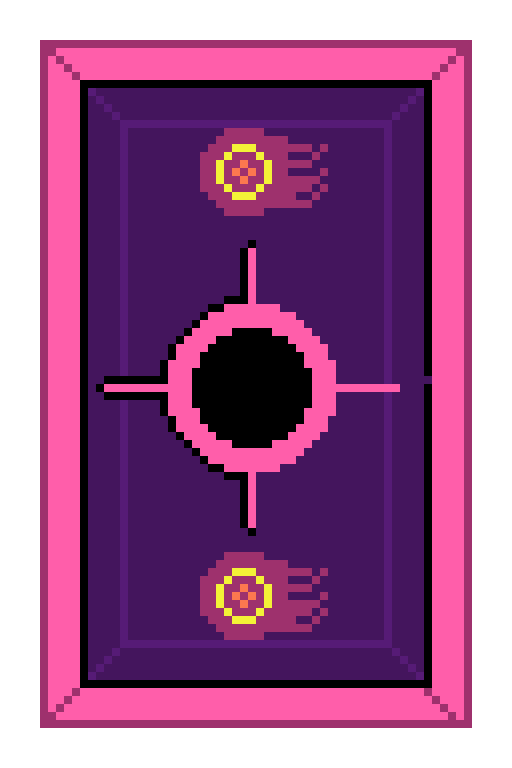
The Fire Turret, Burns all enemies.

### Electric Turret: 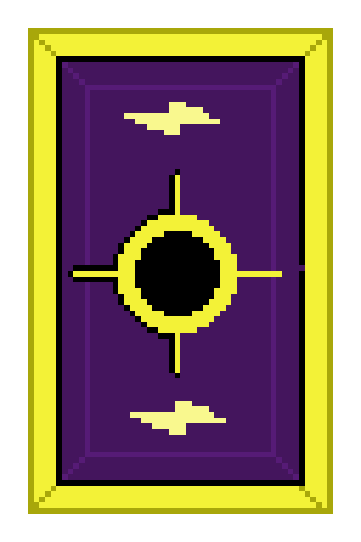
The Electric Turret, electrifies all enemies.

### Freeze Turret: 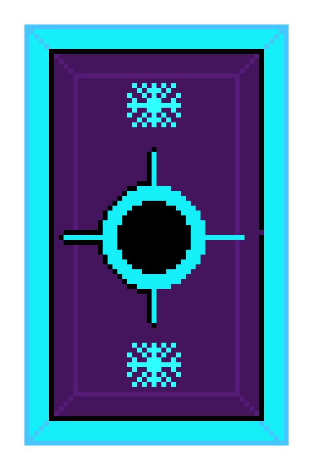
The Freeze turret, freezes the enemies for a certain period.

 

## Enemies 
Neon Defence throws various enemies at you throughout the game. Here are some of the enemy types you will encounter:

### Basic Robot: 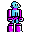
These are the most common enemies you'll face. They have moderate health and deal low damage.

### Reinforced Robot: 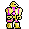
Reinforced robots are tougher than the basic ones, requiring more hits to defeat. Be prepared for a longer fight.

### Mechanic Spider: 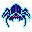
These agile enemies can crawl over obstacles and move quickly towards the Sun. Watch out for their speed.

### Drone: 
Drones are aerial enemies that fly above the ground defences. You'll need to use turrets capable of hitting airborne targets to deal with them.

### Boss: 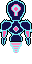
Boss enemies are formidable adversaries that possess high health and deal significant damage. They pose a real threat to the Sun and require careful planning to defeat.  

 

___

 

## How to Play

### Build Turrets: 
Use the in-game resources to construct and place turrets strategically. Experiment with different turret combinations to find the most effective defence against each enemy type.

### Upgrade Turrets: 
As you progress, you'll earn resources that can be used to upgrade your turrets. Enhance their firepower, range, and special abilities to improve their effectiveness against the increasingly challenging enemies.

### Monitor Resources: 
Keep an eye on your available resources, as they are limited. Spend them wisely to optimize your defence strategy.

### Defend the Sun: 
Your primary objective is to protect the Sun from enemy incursions. Ensure that no enemy reaches the Sun by eliminating them with your turrets.

### Lives and Game Over: 
You start with three lives. If an enemy reaches the Sun, you lose a life. Losing all three lives will result in a game over. Strive to maintain a strong defence and keep the Sun safe.

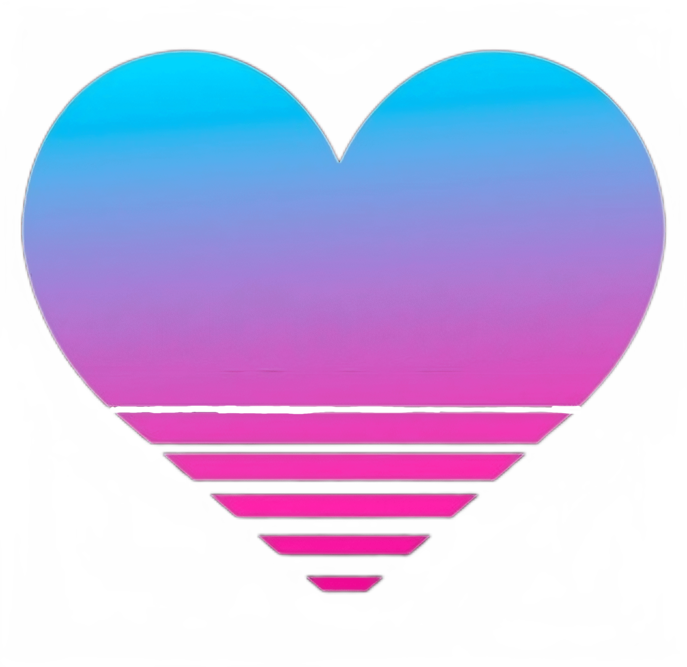

## Controls 
The game can be played using the following controls:

To place a turret, click on the type of turrets you'd like to place and then click on the tile with the little sun to place it .

Power Turrets are automatically placed when you click on their buttons and are not moveable.
You can sell a turret by clicking on it , but it'll give you half the resources it cost back.

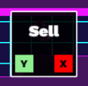

 

___

 

## Design

### Colour Scheme

For the colours I based them off the Synthwave/Retrowave Colours.

 

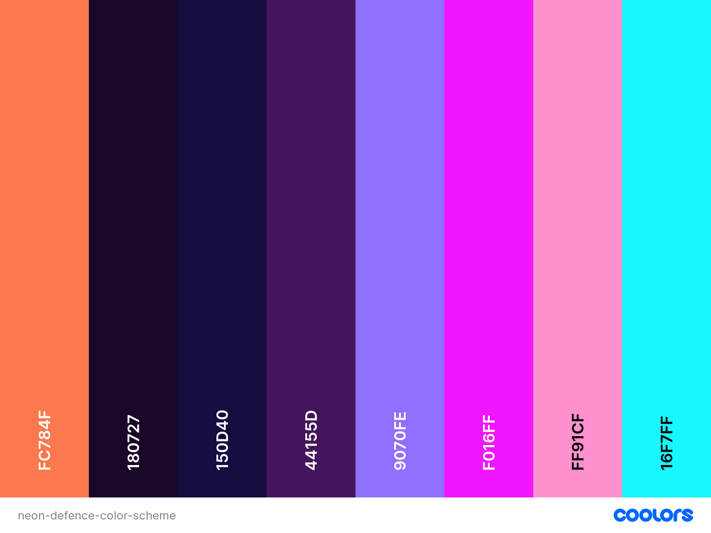

#### Logo & Favicon

 |                       **Logo**                               |                           **Favicon**                                  |
  | :----------------------------------------------------------:        | :-------------------------------------------------------------------:        |
  | 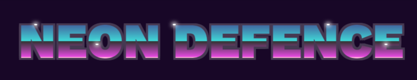  | 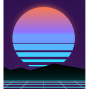     |

## Screenshots
 |                       **Intro Page**                               |                           **Intro Menu**                                  |
  | :----------------------------------------------------------:        | :-------------------------------------------------------------------:        |
  | 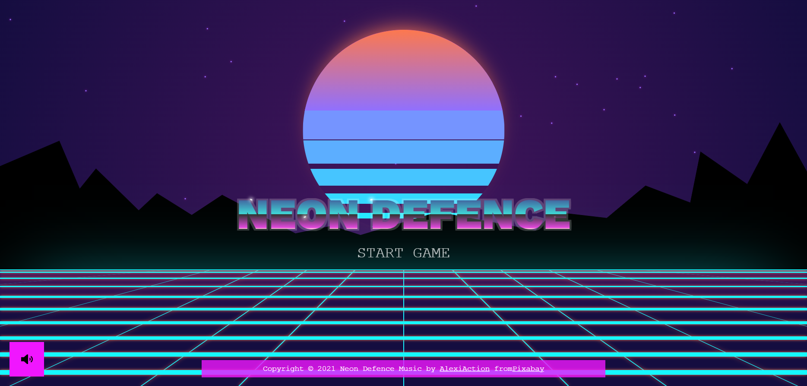  | 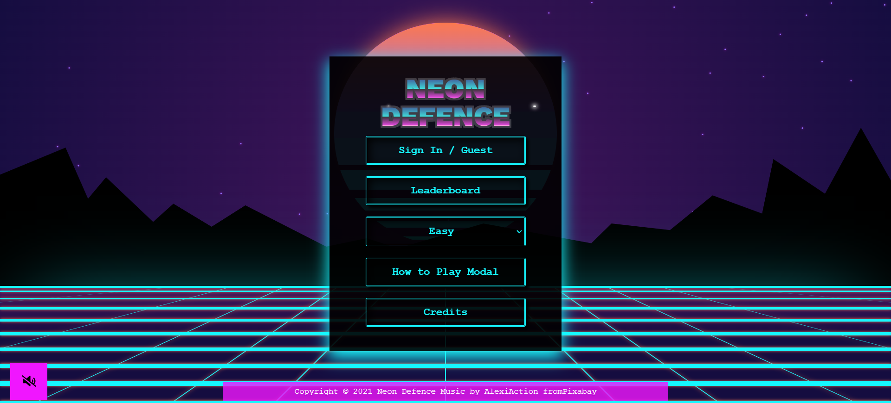     |
   |                       **Game Page**                               |                           **Game Over Screen**                                  |
  | :----------------------------------------------------------:        | :-------------------------------------------------------------------:        |
  | 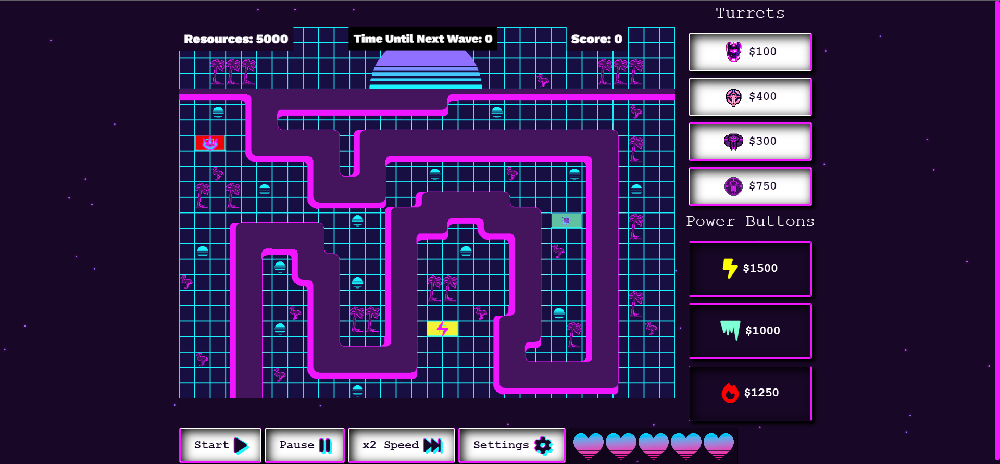  | 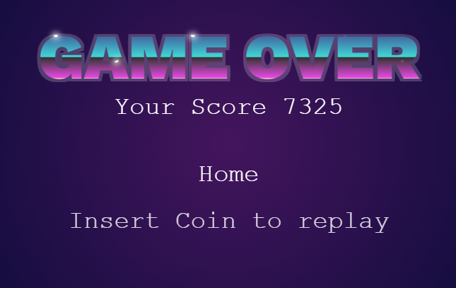     |

 

___

 

## Future Implementations.

 * Add varied Modes/Levels..

 

___

 

## Installation [Add installation instructions here]

 

___

 

## Tech
In the tech section, we provide information about the technology stack, dependencies, and any technical details related to the project.

### Tech Stack

For the development of Rainbow warriors we made use of the following stack of technologies:

##### Front-End
 -  [HTML5](https://developer.mozilla.org/en-US/docs/Glossary/HTML5)
 -  [CSS3](https://developer.mozilla.org/en-US/docs/Web/CSS)
 - [Tiled](https://www.mapeditor.org/)

##### Back-End
 -  [JavaScript](https://developer.mozilla.org/en-US/docs/Web/JavaScript)
 - [Phaser.JS](https://phaser.io/)
 -  [Node.JS](https://nodejs.org/en)
 -  [Vite.js](https://vitejs.dev/)
 - [Parcel.js](https://parceljs.org/)
 -  [Firebase](https://firebase.google.com/)

 

##### Technologies Used
*  [Adobe Illustrator](https://www.adobe.com/uk/products/illustrator.html) - To create site icons.
*  [Adobe Photoshop](https://www.adobe.com/uk/products/photoshop.html) - To edit images.

*  [VScode](https://code.visualstudio.com) - code editing
*  [GIT](https://git-scm.com/), [GitHub](https://github.com/) - tracking, storing, hosting project
*  [GitHub Desktop](https://desktop.github.com/) - for local development

*  [Google Fonts:](https://fonts.google.com/) - Google fonts were used to import the 'Inknut Antiqua' font into the style.css file which is used on all pages throughout the project.
* [Coolors](https://coolors.co/) - Coolors was used for choosing the website's colours palette.
*  [Shields.io](https://shields.io/) - To add badges to the README

*  [Chrome DevTools](https://developer.chrome.com/docs/devtools) -  - To troubleshoot and test features, solve issues with responsiveness and styling.
* [Am I Responsive?](http://ami.responsivedesign.is/) &  [Responsinator](http://www.responsinator.com/) - To show the website image on a range of devices.
* [BrowserStack](https://www.browserstack.com/guide/browser-compatibility-for-variable-fonts) - To check site responsiveness on live devices.
* [Polypane Browser](https://polypane.app/) - Responsive & Accessibility Testing and more!
* [ghostCSS](http://wernull.com/2013/04/debug-ghost-css-elements-causing-unwanted-scrolling/) - To check for layout issues.
* [Can I Use](https://caniuse.com/#home) - to check for CSS Browser comparability issues.

 

___

 

## Credits 
All resources were created for the games. Made by:
- [Darrach Barneveld](https://github.com/DarrachBarneveld)
- [Devan Cadman](https://github.com/devan-cadman)
- [Tanguy L'Alexandre](https://github.com/tlalexandre)

 

## License 
[Specify the license under which the game is distributed, if applicable]

## Feedback and Support
[Provide instructions on how users can provide feedback or seek support]
